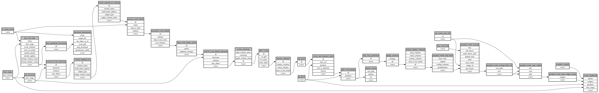

```
# AUTOGENERATED BY ECOSCOPE-WORKFLOWS; see fingerprint in README.md for details

```

```yaml
# fingerprint:
artifacts_sha256_basic: 9747150a735383389e6e7fff19255f2c679b92ad5ab5252b5b1666c00509cdd0
artifacts_sha256_strict: 3cf898a66dee6f856a2b9f1638cc608821fd695b4cb9acb2eff869fb74104e75
installed_requirements:
- channel: https://repo.prefix.dev/ecoscope-workflows/
  name: ecoscope-platform
  version: {version: ==2.11.11}
- channel: https://repo.prefix.dev/ecoscope-workflows-custom/
  name: ecoscope-workflows-ext-custom
  version: {version: ==0.1.0rc3}
params_sha256: 57c44104c2169691a8abc235c37b7f8461e2e484c338655ab56be61807f9b6e9
spec_sha256: 156963bce773530dc9c922f58bfbb29bde69fbddc8774d28d47507ab8e1dc89d

```

# ecoscope-workflows-download-events-workflow


